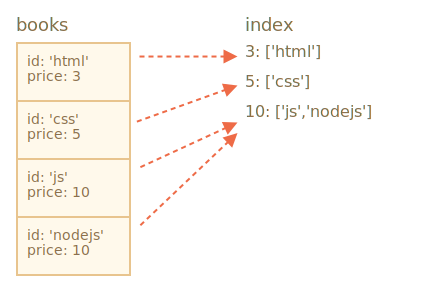

libs:
  - 'https://cdn.jsdelivr.net/npm/idb@3.0.2/build/idb.min.js'

---

# IndexedDB

IndexedDB è un databasae built-in, molto più potente di `localStorage`.

- archiviazione di key/value: il valore può essere (quasi) qualsiasi cosa, con chiavi di diverse tipologie.
- Supporto delle transazioni per mantenere alta l'affidabilità.
- Supporta key range queries, indexes.
- possibilità di archiviare molti più dati rispetto a `localStorage`.

Questo potere è solitamente eccessivo per tradizionali apps client-server. IndexedDB è inteso per apps offline, , in modo da poter essere combinato con ServiceWorkers e altre tecnologie.

L'interfaccia nativa di IndexedDB , descritta nelle specifiche <https://www.w3.org/TR/IndexedDB>, è event-based.

Possiamo anche usare `async/await` con l'aiuto di  un promise-based wrapper, come questo <https://github.com/jakearchibald/idb>. Tutto ciò è molto conveniente,  ma il wrapper non è perfetto, non può rimpiazzare gli eventi per tutti i casi. Quindi iniziamo con gli eventi e in seguito, dopo aver compreso il funzionamento di Indexedb, useremo il wrapper.

## Open database

Per iniziare a lavorare con IndexedDb, prima dobbiamo aprire un database.

La sintassi:

```js
let openRequest = indexedDB.open(name, version);
```

- `name` -- -una stringa, il nome del database
- `version` -- un numero intero positivo come versione, `1` di default (spiegato sotto).

Possiamo avere diversi database con nomi diversi, ma tutti esistono all'interno dell'originale (domain/protocol/port). Siti internet non possono accedere ai dabase degli altri siti.

Dopo aver chiamato la funzione, dobbiamo creare una lista degli eventi nell'oggetto `openRequest`:
- `success`: il database è pronto, c'è il "database object" in `openRequest.result`, che dovremmo usare per ulteriori chiamate.
- `error`: apertura fallita.
- `upgradeneeded`: il database è pronto, ma la versione è vecchia(vedi sotto).

**IndexedDB ha un meccanismo built-in di "schema versioning",assente nei databse server-side..**

Rispetto ai database server-side, IndexedDB è client-side, i dati sono archiviati nel browser, dunque noi sviluppatori, non abbiamo accesso. Ma quando pubblichiamo una nuova versione della nostra app, potremmo aver bisogno di aggiornare il database.

Se la versione del database locale è minore rispetto a quella specificata in `open`, allora un evento speciale `upgradeneeded` viene azionato, e possiamo comparare le versioni e aggiornare le strutture dei dati se necessario.

Questo evento viene anche attivato quando il database non esiste ancora, quindi possiamo inizializzarlo.

Quando pubblicheremo la prima app, verrà aperta con la versione `1` e eseguiremo l'inizializzazione nel gestore `upgradeneeded`:

```js
let openRequest = indexedDB.open("store", *!*1*/!*);

openRequest.onupgradeneeded = function() {
  // si attiva se il client non ha database
  // ...perform initialization...
};

openRequest.onerror = function() {
  console.error("Error", openRequest.error);
};

openRequest.onsuccess = function() {
  let db = openRequest.result;
  // continua a lavorare con il databse utilizzando db object
};
```

Quando pubblicheremo la seconda versione:

```js
let openRequest = indexedDB.open("store", *!*2*/!*);

openRequest.onupgradeneeded = function() {
  // la versione esistente del database è minore di 2 (o non esiste)
  let db = openRequest.result;
  switch(db.version) { // existing db version
    case 0:
      // versione 0 significa che il client non ha database
      // esegui inizializzazione
    case 1:
      // client aveva la versione 1
      // update
  }
};
```

Dunque, in `openRequest.onupgradeneeded` aggiorniamo il database. Presto vedremo come fare. In seguito `openRequest.onsuccess` si attiva solo se il gestore finisce senza errori.

In seguto a `openRequest.onsuccess` abbiamo il database object in `openRequest.result`, che useremo per ulteriri operazioni.

per cancellare un database:

```js
let deleteRequest = indexedDB.deleteDatabase(name)
// deleteRequest.onsuccess/onerror traccia il risultato
```

```warn header="Possiamo aprire una vecchia versione?"
ora cosa succede se proviamo ad aprire il database con una versione minore di quella corrente?Es, la versione DB esistente è 3 e cerchiamo di aprlo  con la 2 `open(...2)`.

Un errore, `openRequest.onerror` viene attivato.

Questa situazione potrebbe capitare se il visitatore ha caricato un codice datato, esempio da un proxi cache. Dovremmo controllare `db.version`, suggerirgli di ricaricare la pagina. inoltre ricontrollare il nostro caching headers per assicurarci che i visitatori non ottengano codice vecchio.
```

### Problema di aggiornamento parallelo

Mentre discutiamo delle versioni, affrontiamo un altro problema.

Ipotizziamo che un visitatore apra il nostro sito in una tab del browser, con versione del database 1.

In seguito aggiorniamo la versione e lo stesso visitatore apre il nostro sito in un altra tab. Quindi ci sono due tabs,
entrambe sul nostro sito, ma una ha una connessione aperta con DB version 1, mentre la seconda sta tentando di aggiornare con  `upgradeneeded` handler.

Il problema sta nel fatto che il database è condiviso tra le due tabs, poichè è lo stesso sito, stessa sorgente. Non può avere due versioni allo stesso tempo. Per effettuare l'aggiornamento alla seconda versione, tutte le connessioni alla versione 1 dovranno essere chiuse.

Affinchè questo accada, l'evento `versionchange`  attiva un open database object quando si sta tentando un aggiornamento parallelo. Dovremmo seguire l'evento, dovremmo chiudere il database(e probabilmente suggerire al visitatore di ricaricare la pagina, per caricare il codice aggiornato).

Se non lo chiudiamo, la seconda connessione verrà bloccata con un evento `blocked` invece di un evento`success`.

Ecco il codice per ottenere questo risultato:

```js
let openRequest = indexedDB.open("store", 2);

openRequest.onupgradeneeded = ...;
openRequest.onerror = ...;

openRequest.onsuccess = function() {
  let db = openRequest.result;

  *!*
  db.onversionchange = function() {
    db.close();
    alert("Database is outdated, please reload the page.")
  };
  */!*

  // ...il database è pronto, usalo...
};

*!*
openRequest.onblocked = function() {
  // there's another open connection to same database
  // and it wasn't closed after db.onversionchange triggered for them
};
*/!*
```

Qui facciamo due cose:

1. Aggiungiamo  `db.onversionchange` listener dopo un apertura di successo, per essere informationi riguardo il tentativo di aggiornamento parallelo.
2. Aggiungiamo `openRequest.onblocked` listener per gestire i casi quando una vecchia connessione non è stata chiusa. Questo non succede se la chiuidamo in `db.onversionchange`.

Esistono altre situazioni.. Per esempio, possiamo prenderci il tempo per chiudere il tutto con più calma in `db.onversionchange`, indicando il visitatore di salvare i dati prima che la connessione venga chiusa. La nuova connessione di aggiornamento verrà bloccata immediatamente dopo `db.onversionchange` avrà finito senza chiudere,e possiamo chiedere al visitatore chiedere al visitatore nella nuova tab di chiudere le altre tabs per l'aggiornamento.

Questo tipo di collisione degli aggiornamenti capita raramente, ma comunque dovremmo avere un modo per gestire, ad esempio l' `onblocked` handler, di modo che il nostro  script non sorprenda l'utente bloccandosi.

## Object store

Per archiviare qualcosa su IndexedDB, abbiamo bisogno di un *object store*.

Un object store è un concetto chiave di IndexedDB. Le controparti in altri database sono chiamate "tavole" o "collezioni". Qui i dati vengono archiviati. Un database potrebbe avere più stores: uno per utenti, uno per i beni da vendere, etc.

Nonostante vengano chiamati "object store", dati basilari possono comunque essere archiviati.

**Possiamo immagazzinare quasi ogni tipo di valore, inclusi oggetti complessi.**

IndexedDB usa l'[algoritmo di serializzazione standard](https://www.w3.org/TR/html53/infrastructure.html#section-structuredserializeforstorage)per clonare e immagazzinare un oggetto. Simile a `JSON.stringify`, ma più potente, in grado di archiviare molte più tipologie di dati.

Un esempio di oggetto che non può essere immagazzinato: un oggetto con referenze circolari. Questo tipo di oggetti non 
sono serializzabili. Anche `JSON.stringify` fallisce nell'impresa.

**Deve esserci una `key` univoca per ogni valore nello store.**     

Una key deve avere un tipo di: numero, data, stringa, binary, o array. è un identificativo unico: possiamo cercare/rimuovere/aggiornare valori tramite le key.


Come vedremo presto, possiamo fornire una key quando aggiungiamo un valore allo store, simile a `localStorage`. Ma quando
immagazziniamo oggetti, IndexedDB ci permette di impostare una object property come key, e questo è molto più conveniente.
Oppure possiamo auto generarle (keys).

Ma prima dobbiamo creare un object store.

La sinstassi è questa:
```js
db.createObjectStore(name[, keyOptions]);
```

Notare  che l'operazione avviene in sincrono, non è necessario `await.

- `name` è il nome dello store , esempio `"libri"` per libri,
- `keyOptions` è un oggetto opzionale con due propietà::
  - `keyPath` -- un percorso per una propietà dell'oggetto che IndexedDB userà come key, esempio `id`.
  - `autoIncrement` -- se `true`, allora la key per il nuovo stored object è generata automaticamente, come numero pari incrementale.

 Se non forniamo`keyOptions`, dovremo provvedere una key esplicita in seguito, quando archiviamo un object.

Per esempio, questo object store usa la propietà `id` come key:
```js
db.createObjectStore('books', {keyPath: 'id'});
```

**Un object store può essere solo creato/modificato mentre si aggiorna la versione DB, nel gestore `upgradeneeded`.**

Questa è una limitazione tecnica. All'esterno del gestore potremo aggiungere/rimuovere/aggiornare i dati, ma gli object stores possono essere creati/rimossi/alterati solo durante l'aggiornamento della versione.

Per effettuare un'aggiornamento del database, esistono due approcci:
1. Possiamo implementare le funzioni di aggiornamento pre-versioni: da 1 a 2, da 2 a 3, da 3 a 4 etc. In seguito, in `upgradeneeded` possiamo comparare le versioni (esempio obsoleta 2, nuova 4) e inviare gli aggiornamenti per-versione step by step, per ogni versione intermedia (2 a 3, poi 3 a 4).
2. O possiamo solo esaminare il database: ottenere una lista object stores esistenti come `db.objectStoreNames`. Questo oggetto è un  [DOMStringList](https://html.spec.whatwg.org/multipage/common-dom-interfaces.html#domstringlist) che possiede il metodo `contains(name)` per verificare l'esistenza dell'oggetto. In seguito potremo aggiornare im base a cosa esiste o no.

Per piccoli database la seconda via potrebbe essere più semplice.

Ecco la dimostrazione del secondo approccio:Here's the demo of the second approach:

```js
let openRequest = indexedDB.open("db", 2);

// creare/aggiornare il database senza controllo versione
openRequest.onupgradeneeded = function() {
  let db = openRequest.result;
  if (!db.objectStoreNames.contains('books')) { // se "books" store non esiste
    db.createObjectStore('books', {keyPath: 'id'}); // lo crea
  }
};
```


Per cancellare un object store:

```js
db.deleteObjectStore('books')
```

## Transazioni

Il termine "transazione è generico, viene usato in vari modi nei database.

Una transazione è un gruppo di operazioni che puossono avere successo o fallire del tutto.

Per esempio, quando una persona compra qualcosa, dobbiamo:
1. sottrarre i soldi dal proprio conto.
2. aggiungere un oggetto al loro inventario.

Sarebbe disastroso se compeltassimo la prima operazione e qualcosa andasse storto, ad esempio manca la corrente e la seconda operazione fallisse. Entrambe le operazioni devo avere successo o fallire(così che la persona non perda i soldi e possa riprovare).

Le transazioni possono garantire il successo delle varie operazioni.

**Tutte le operazioni con i dati devono essere eseguite all'interno di una transazione in IndexedDB.**

Per iniziare la transazione:

```js run
db.transaction(store[, type]);
```

- `store` è il nome dello store a cui la transazione accederà, esempio `"books"`. Può essere un array di store names Se accediamo a store multipli.
- `type` – un tipo di transazione, divisa in:
  - `readonly` -- in cui è possibile solo leggere, di default
  - `readwrite` -- può solo leggere o scrivere dati, ma non creare/rimuovere/alterare oggetti store.

Esiste anche la transazione del tipo `versionchange`:queste transazioni possono eseguire di tutto, ma non possono essere create manualmente. IndexedDB crea automaticamente una transazione `versionchange`quando si apre il database, per il gestore `updateneeded`. Ecco perchè è presente solo un posto in cui possiamo aggiornare la struttura del database, creare/rimuovere object stores.

```smart header="Perchè esistono diversi tipi di transazioni?"
Il motivo per cui le transazioni devono essere etichettate solo `readonly` o `readwrite` è dovuto alle performance.

Molte transazioni `readonly` sono in grado di accedere allo stesso store simultaneamente, ma le transazioni `readwrite` non possono . Una transazione`readwrite` "blocca"lo store dallo scrivere. La prossima transazione dovrà attendere che la prima finisca prima  di accedere allo stesso store.
```

Dopo che la transazione viene creata, possiamo aggiungere un oggetto allo store, in questo modo:

```js
let transaction = db.transaction("books", "readwrite"); // (1)

// ottieni un object store su cui operare
*!*
let books = transaction.objectStore("books"); // (2)
*/!*

let book = {
  id: 'js',
  price: 10,
  created: new Date()
};

*!*
let request = books.add(book); // (3)
*/!*

request.onsuccess = function() { // (4)
  console.log("Book added to the store", request.result);
};

request.onerror = function() {
  console.log("Error", request.error);
};
```

Ci sono principalmente 4 steps:

1. Creare una transazione, menzionando tutti gli stores che andrà ad accedere `(1)`.
2. Ottenere store object tramite `transaction.objectStore(name)` `(2)`.
3. Performa la richiesta dell' the object store `books.add(book)` `(3)`.
4. ...Gestire la richiesta success/error `(4)`, infine eseguire altre richieste se necessario, etc.

Gli object stores supportano due metodi per archiviare un valore:

- **put(value, [key])**
    Aggiunge il `value` nello store. La `key` è fornita solo se l'object store non aveva l'opzione `keyPath` o `autoIncrement`. Se un valore con la stessa key è già presente, verrà rimpiazzato.

- **add(value, [key])**
    SImile a `put`, ma se esiste già un valore con la stessa key, la richiesta fallirà, e un errore chiamato `"ConstraintError"` verrà generato.

Simile all'apertura del database, possiamo inviare una richiesta: `books.add(book)`, e attendere gli eventi `success/error`.

- La `request.result` per `add` è la key del nuovo object.
- L'errore è in `request.error` (se presente).

## Transactions' autocommit

In questo esempio abbiamo iniziato la transazione e creato una richiesta `add`. Ma come indicato in precedenza, una transazione potrebbe avere multiple richieste associate, che devono tutte  avere successo o fallire. Come marchiamo una transazione finita quando non arrivano più altre richieste?

La risposta breve è: non lo facciamo.

Nella prossima versione 3.0 della specifica, ci sarà probabilmente un metodo manuale per finire la transazione, ma ora
nella 2.0 non esiste.

**Quando le richieste di transazioni sono finite e la [microtasks queue](info:microtask-queue) è vuota, viene completata automaticamente.**

Solitamente, possiamo assumere che un transazione viene marcata completata quando tutte le richieste sono completate e il codice è finito.

Dunque nell'esempio sopra, nessun comando speciale è richiesto per finire la transazione.

Il principio delle Transazioni auto-completanti ha un importante effetto collaterale. Non possiamo inserire un operazione asincrona come `fetch`, `setTimeout` nel mezzo della transazione. IndexedDB non terrà la transazione in attesa fino a quando 
non saranno completate.

Nel codice qui sotto `request2` nella linea `(*)` fails, fallisce, perchè la transazione è già completata, non è possibile fare altre richieste al suo interno:

```js
let request1 = books.add(book);

request1.onsuccess = function() {
  fetch('/').then(response => {
*!*
    let request2 = books.add(anotherBook); // (*)
*/!*
    request2.onerror = function() {
      console.log(request2.error.name); // TransactionInactiveError
    };
  });
};
```

Questo perchè `fetch` è un operazione asincrona, una macrotask. Le transazioni sono chiuse prima che il browser inizi a eseguire le macrotask.

Autori di IndexedDB credono che le transazioni dovrebbero avere vita breve. Principalmente per motivi di performance.

In particolare,  transazioni `readwrite` "bloccano" gli stores dalla scrittura. Cosi se una parte dll'applicazione ha iniziato `readwrite` sull' object store `books` , l'altra parte che vorrebbe fare lo stesso, deve attendere:  la nuova transizione "attende" fino a quando la prima viene completata. Questo può portare a strani ritardi se le transazioni richiedono molto tempo.

Dunque come ovviamo al problema?

Nell'esempio sopra potremmo creare una nuova `db.transaction` subido prima della nuova richiesta `(*)`.

Ma sarebbe meglio, se tenessimo le operazioni insieme, in una transazione, per dividere le transazioni IndexedDB e "altre" operazioni asincrone.

Prima di tutto creiamo `fetch`, prepariamo i dati se necessario, in seguito creiamo una transazione e performiamo tutte le richieste del database.

Per rilevare il momento di completamento, possiamo inserire l'evento `transaction.oncomplete`:

```js
let transaction = db.transaction("books", "readwrite");

// ...perform operations...

transaction.oncomplete = function() {
  console.log("Transaction is complete");
};
```

Solo `complete` garantisce che le transazioni vengano salvato per intero. Richieste individuali potrebbero essere completate, ma l'operazione finale di scrittura potrebbe andare male.(esempio I/O error o qualcosa di simile).

Per bloccare la transazione manualmente, chiamare:

```js
transaction.abort();
```
Questo cancella tutte le modifiche fatte dalle richieste e attiva l'evento `transaction.onabort`.


## Error handling

Le richieste di scrittura potrebbero fallire.

Questo è un comportamento conosciuto, non solo dovuto a possibili errori da parte nostra, ma anche per ragioni non 
legate alla transazione in sè. Per esempio, lo spazio di archiviazione potrebbe non essere sufficente. Dunque dobbiamo essere pronti a gestire queste situazioni.

**Una richiesta fallita blocca automaticamente la transazione, cancellando tutti i cambiamenti.**

In alcune situazioni, potremmo gestire l'errore (ad esempio, riprova con una nuova richiesta), senza cancellare i cambiamenti esistentie continuare la transazione. Questo è possibile. Il gestore `request.onerror` è in grado di prevenire il blocco della transazione chiamando `event.preventDefault()`.

In questo esempio un nuovo libro viene aggiunto con la stessa key (`id`) come esistente. Il metodo `store.add` genera un `"ConstraintError"` in questo caso. Lo gestiamosenza cancellare la transazione:
```js
let transaction = db.transaction("books", "readwrite");

let book = { id: 'js', price: 10 };

let request = transaction.objectStore("books").add(book);

request.onerror = function(event) {
  // ConstraintError avviene quando un object wcon lo stesso id è già esistente.
  if (request.error.name == "ConstraintError") {
    console.log("Book with such id already exists"); // gestisce l'errore
    event.preventDefault(); // don't abort the transaction
    // use another key for the book?
  } else {
    // unexpected error, non può gestirlo
    // la transazione verrà bloccata
  }
};

transaction.onabort = function() {
  console.log("Error", transaction.error);
};
```

### Event delegation

Abbiamo bisogno di onerror/onsuccess per ogni richiesta? Non sempre. Possiamo usare la delegazione evento.

**IndexedDB events bubble: `request` -> `transaction` -> `database`.**

Tutti gli eventi sono eventi DOM, con cattura e bubbling, ma solitamente solo il bubbling stage viene usato.

Cosi possiamo intercettare tutti gli errori usando il gestore `db.onerror` handler, per riportare oppure per altri motivi:

```js
db.onerror = function(event) {
  let request = event.target; // la richiesta che ha causato un errore

  console.log("Error", request.error);
};
```

...Ma se un error viene gestito interamente? Non vogliamo riportarlo in quel caso.

Possiamo bloccare il bubbling e di conseguenza `db.onerror` usando `event.stopPropagation()` in `request.onerror`.

```js
request.onerror = function(event) {
  if (request.error.name == "ConstraintError") {
    console.log("Book with such id already exists"); // gestisci l'errore
    event.preventDefault(); // non annullare la transazione
    event.stopPropagation(); // non bubble error up, gestiscilo
  } else {
    // non fare nulla
    // la transazione verrà annullata
    // possiamo gestire l'errore in transaction.onabort
  }
};
```

## RIcerca tramite keys

Ci sono due tipi principali di ricerca in un object store:
1. Da una key o una key range. Ovvero: per `book.id`nel nostro archivio "books".
2. Da un altro campo oggetti, esempio `book.price`.

Prima affrontiamo le keys e key range `(1)`.

Metodi che includono ricerca supportano anche exact keys chiamate "range queries" -- [IDBKeyRange](https://www.w3.org/TR/IndexedDB/#keyrange) objects che specificano una "key range".

Ranges sono creati usando le seguenti funzioni:

- `IDBKeyRange.lowerBound(lower, [open])` means: `>lower` (or `≥lower` if `open` is true)
- `IDBKeyRange.upperBound(upper, [open])` means: `<upper` (or `≤upper` if `open` is true)
- `IDBKeyRange.bound(lower, upper, [lowerOpen], [upperOpen])` means: between `lower` and `upper`, with optional equality if the corresponding `open` is true.
- `IDBKeyRange.only(key)` -- a range that consists of only one `key`, rarely used.

Tutti metodi di ricerca accettano un argomento `query` che può essere una exact key o unaa key range:

- `store.get(query)` -- cerca per il primo valore tramite una key o range.
- `store.getAll([query], [count])` -- cerca per tutti i valori, limita per `count` se fornito.
- `store.getKey(query)` -- cerca per la prima key che soddisfa la query, solitamnete un range.
- `store.getAllKeys([query], [count])` -- cerca per tutte le keys che soddisfano la query, solitamente un range, fino a `count` se fornito.
- `store.count([query])` -- ottieni la conta totale di keys che soddisfano la query, solitamente un range.

Per esempio, abbiamo tanti libri nel nostro store. Ricardate il campo `id` è la key, dunque questi metodi possono ricercare
tramite `id`.

Esempi di richieste:

```js
// ottieni un libro
books.get('js')

// ottieni libri con 'css' < id < 'html'
books.getAll(IDBKeyRange.bound('css', 'html'))

// ottieni libri con 'html' <= id
books.getAll(IDBKeyRange.lowerBound('html', true))

// ottieni tutti i libri
books.getAll()

// ottieni tutte le keys: id >= 'js'
books.getAllKeys(IDBKeyRange.lowerBound('js', true))
```

```smart header="Object store is always sorted"
Object store ordina i valori per key internamente.

Le richieste che mostrano tanti valori vengono presentati sempre ordinate per key.
```


## Ricerca su ogni campo con un index

Per ricercare usando altri campi Objects, dobbiamo creare un ulteriore struttura dati chiamata "index".

Un Index è un "add-on" dello store che traccia  un campo di un object dato. Per ogni valore di quel campo, archivia una lista di keys per oggetti che hanno quel valore. Sarà più chiaro nell'immagine seguente.

La sintassi:

```js
objectStore.createIndex(name, keyPath, [options]);
```

- **`name`** -- nome dell'index,
- **`keyPath`** -- Il percorso del campo dell'oggetto che l'index dovrebbe tracciare (cercheremo in quel settore).,
- **`option`** -- Un oggetto opzionale con propietà:
  - **`unique`** -- Se vero, potrebbe esserci solo un oggetto nello store con il valore dato al `keyPath`. L'index
confermerà generando un errore se tentiamo di aggiungere a un duplicato.
  - **`multiEntry`** -- usato solo se il valore su `keyPath` è un array. In quel caso, di default l'idex tratterà l'intero array come key. Ma se`multiEntry` è vero, allora l'index terrà una lista degli oggetti archiviati per ogni valore in quell array. I membri dell array diventano index keys.

Nel nostro esempio, archiviamo libri con un valore key `id`.

Assumiamo di voler cercare per prezzo `price`.

Prima, dobbiamo creare un index. Dovrà essere fatto in `upgradeneeded`, come un object store:

```js
openRequest.onupgradeneeded = function() {
  // we must create the index here, in versionchange transaction
  let books = db.createObjectStore('books', {keyPath: 'id'});
*!*
  let index = inventory.createIndex('price_idx', 'price');
*/!*
};
```

- L'index traccerà il campo `price`.
- Il prezzo non è unico, potrebbero esserci più libri con lo stesso prezzo, dunque non impostiamo l'opzione `unique`.
- Il prezzo non è un array, quindi l'opzione `multiEntry` non è applicabile.

Immagina che il nostro `inventory` abbia 4 libri. Ecco un immagine che mostra esattamente come risulterà `index`:



Come detto in precedenza, l'index per ogni valore del `price` (secondo argomento) mantiene la lista delle keys con quel prezzo.

L'index index si mantiene aggiornato automaticamente, non dobbiamo preoccuparcene.

Ora, quando vogliamo cercare per un prezzo dato, applichiamo lo stesso metodo di ricerca all'index:

```js
let transaction = db.transaction("books"); // readonly
let books = transaction.objectStore("books");
let priceIndex = books.index("price_idx");

*!*
let request = priceIndex.getAll(10);
*/!*

request.onsuccess = function() {
  if (request.result !== undefined) {
    console.log("Books", request.result); // array dei libri con prezzo=10
  } else {
    console.log("No such books");
  }
};
```

possiamo anche usare `IDBKeyRange` per creare ranges e cercare libri con prezzi più bassi/alti:

```js
// find books where price < 5
let request = priceIndex.getAll(IDBKeyRange.upperBound(5));
```

Gli index sono ordinati internamente dal campo oggetti tracciato, `price` Mentre eseguimao la ricerca, 
i risultati sono ordinati per `price`.

## Cancellare dallo store.

Il metodo `delete` cerca valori da cancellare da una query, il format da chiamare è simile a `getAll`:

- **`delete(query)`** -- cancella valori combacianti dalla query.

Per esempio:
```js
// cancella il libro con id='js'
books.delete('js');
```

Se preferiamo cancellare libri in base a loro prezzo o un altro campo, dovremo prima cercare la key nell'index, poi usare `delete`:

```js
// trova la key in cui prezzo = 5
let request = priceIndex.getKey(5);

request.onsuccess = function() {
  let id = request.result;
  let deleteRequest = books.delete(id);
};
```

Per cancellare tutto:
```js
books.clear(); // Pulisci l'archivio.
```

## Cursors

Metodi come `getAll/getAllKeys` forniscono un array di keys/values.

Ma un archivio di object può essre enorme, più grande della memoria disponibile. uindi getAll fallirà nell'ottenere  i registri come array.

Cosa possiamo fare?

Cursors forniscono i mezzi per aggirare il problema.


**I *cursor* è un oggetto speciale che attraversa gli object archiviati, data una query, e fornisce una key/value alla volta, salvando la memoria.**

Mentre un oggetto nello store viene ordinato internamente dalla key, il cursore attraversa gli store in base alle key 
(ascendenti di default).
La sintassi:
```js
// simile a getAll, ma con un cursor:
let request = store.openCursor(query, [direction]);

// per ottenere le keys, non i valori (come getAllKeys): store.openKeyCursor
```

- **`query`** is a key or a key range, same as for `getAll`.
- **`direction`** è un argomento opzionale che permette l'uso di:
  - `"next"` --di default il cursore attraversa il registro dalla key più bassa.
  - `"prev"` -- In ordine inverso: dal basso del registro con la key più grande.
  - `"nextunique"`, `"prevunique"` -- come prima, ma salta i registri con la stessa key (solo per cursori sulgli indexes, esempio per più libri con prezzo =5 solo il primo verrà mostrato).

**La differenza principale del cursor è che `request.onsuccess` si attiva più volte: una per ogni risultato.**

Ecco un esempio su come usare un cursore:

```js
let transaction = db.transaction("books");
let books = transaction.objectStore("books");

let request = books.openCursor();

// chiamato per ogni libro trovato dal cursor
request.onsuccess = function() {
  let cursor = request.result;
  if (cursor) {
    let key = cursor.key; // book key (id field)
    let value = cursor.value; // book object
    console.log(key, value);
    cursor.continue();
  } else {
    console.log("No more books");
  }
};
```

I metodi principale del cursore sono:

- `advance(count)` -- avanza il cursore `count` volte, saltando valori.
- `continue([key])` -- avanza il cursore al prossimo valore nel range corrispondente (o subito dopo`key` se fornito).

Se esistono altri valori che corrispondono al cursor o no`onsuccess`viene chiamato, e in `result` possiamo ottenenre il cursor puntando al prossimo registro, oppure`undefined`.

In questo esempio, il cursore è stato creato per l'object store.

Possiamo anche creare un cursore su di un index. Come ricordiamo, gli indexes ci permettono di cercare usando un object field. I Cursori sugli indexes eseguono lo stesso sugli object stores -- Salvano memoria offrendo un valore alla volta.

Per cursori sugli indexes, `cursor.key` is the index key (e.g. price), è l'index key (prezzo), e dovremo usare la propietà per i key object`cursor.primaryKey`:

```js
let request = priceIdx.openCursor(IDBKeyRange.upperBound(5));

// chiamato per ogni registro
request.onsuccess = function() {
  let cursor = request.result;
  if (cursor) {
    let key = cursor.primaryKey; // il prossimo object store key (id field)
    let value = cursor.value; // il prossimo object store object (book object)
    let key = cursor.key; // la prossima index key (price)
    console.log(key, value);
    cursor.continue();
  } else {
    console.log("No more books");
  }
};
```

## Promise wrapper

Aggiungere `onsuccess/onerror` a ogni richiesta è una sfida piuttosto ardua. A volte possiamo renderci la vita più facile usando delegazione eventi, esempio impostare i gestori completamente sulle transazioni, ma `async/await` è molto più conveniente.

Useremo un piccolo wrapper <https://github.com/jakearchibald/idb> in seguito nel capitolo.  Crea un global `idb` object con metodo IndexeDB [promisified](info:promisify).

In seguito, invece di `onsuccess/onerror` possiamo scrivere questo:

```js
let db = await idb.openDb('store', 1, db => {
  if (db.oldVersion == 0) {
    // perform the initialization
    db.createObjectStore('books', {keyPath: 'id'});
  }
});

let transaction = db.transaction('books', 'readwrite');
let books = transaction.objectStore('books');

try {
  await books.add(...);
  await books.add(...);

  await transaction.complete;

  console.log('jsbook saved');
} catch(err) {
  console.log('error', err.message);
}

```

Cosi avremo tutto il "codice asincrono" e "try...catch".

### Error handling

Se non acciuffiamo l'errore, cadrà attraverso, fino al primo `try..catch`.

Un errore non catturato diventa un  evento "rigetto non gestito" nell'object `window`.

Possiamo gestire questi errori in questo modo:

```js
window.addEventListener('unhandledrejection', event => {
  let request = event.target; // IndexedDB native request object
  let error = event.reason; //  Unhandled error object, same as request.error
  ...report about the error...
});
```

### Trappola della "Transazione inattiva


Come già sappiamo, una traduzione auto-completa non appena il browser ha completato con il codice corrente e  le microtasks. Cosi se inseriamo una microtask come  `fetch` nel mezzo della transazione, allora la transazione non aspetterà di finire. Si auto-completerà. Cosi la prossima richiesta al suo intero fallirà.


Per un promise wrapper e `async/await` la situazione è la stessa.

Ecco un esempio di `fetch` nel mezzo della transazione:

```js
let transaction = db.transaction("inventory", "readwrite");
let inventory = transaction.objectStore("inventory");

await inventory.add({ id: 'js', price: 10, created: new Date() });

await fetch(...); // (*)

await inventory.add({ id: 'js', price: 10, created: new Date() }); // Error
```

Il prossimo `inventory.add` dopo `fetch` `(*)` fallisce con l'errore "inactive transaction", perchè la transazione è già in corso e chiusa in quel momento.

La soluzione è la stessa usata con un IndexedDB nativo: Puoi fare una nuova transazione o semplicemente
dividere le cose.
1. Preparare i dati e prende tutto ciò che serve all inizio.
2 in seguito salvare il database.

### Getting native objects

Internamente, il wrapper peforma una richiesta nativa su IndexedDB, aggiungendoci `onerror/onsuccess`, and returns a promise that rejects/resolves with the result.

Questo funziona la maggior parte delle volte. Gli esempi sono nella pagina seguente: <https://github.com/jakearchibald/idb>.

In casi rari, quando abbiamo bisogno dell'originale `request` object,  possiamo accedervi come propietà `promise.request`:

```js
let promise = books.add(book); // get a promise (don't await for its result)

let request = promise.request; // native request object
let transaction = request.transaction; // native transaction object

// ...do some native IndexedDB voodoo...

let result = await promise; // if still needed
```

## Sommario

IndexedDB può essere descritto come "archivio locale sotto steroidi". è un semplice database key-value, potente abbastanza
per apps offline ma comunque facile da usare.

Il miglior manuale è il seguente 2.0,(https://w3c.github.io/IndexedDB), ma alcuni metodi dal 3.0 (non c'è molta differenza) sono supportati parzialmente (https://w3c.github.io/IndexedDB/).

L'uso basilare può essere descritto con i seguenti punti:

1. Ottieni un wrapper come idb [idb](https://github.com/jakearchibald/idb).
2. Apri un database: `idb.openDb(name, version, onupgradeneeded)`
    - Crea object storages e indexes nel gestore `onupgradeneeded` o esegui un aggiornamento di versione se necessario.
3. Per richieste:
    - Crea una transazione `db.transaction('books')` (readwrite se necessario).
    - Ottieni gli object store `transaction.objectStore('books')`.
4. In seguito, per cercare tramite key, usa i metodi direttamente sugli object store.
    - per cercare tramite un campo oggetto, crea un index.
5. Se i dati sono troppo grandi per la memoria, usa un cursor.

Ecco una piccola app demo:

[codetabs src="books" current="index.html"]
